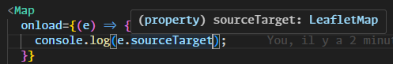

# @radiofrance/svelte-leaflet

Simple Leaflet maps for your Svelte projects.

## Features

- Works in SSR pages
- TypeScript : events, props and options are fully typed
- Simple event usage with the `oneventname` syntax
  - 
  - `event.sourceTarget` is correctly typed
- Fully reactive : update props and options, the components will update
- Customize `DivIcon`, `Popup` and more with Svelte components or HTML instead of strings
- Single dependency : no `leaflet` or `@types/leaflet` needed

## Compatibility

- Version 1.0.0 and above are compatible with Svelte 5.
- For Svelte 3 and 4, use version 0.1.x (not actively maintained).

## Install

`npm i -D @radiofrance/svelte-leaflet`

## Components

### UI Layers

- ✅ Marker
- DivOverlay _(abstract class)_
- ✅ Popup
- ✅ Tooltip

### Raster Layers

- ✅ TileLayer
- ✅ TileLayer.WMS
- ✅ ImageOverlay
- ✅ VideoOverlay

### Vector Layers

- Path
- ✅ Polyline
- ✅ Polygon
- ✅ Rectangle
- ✅ Circle
- ✅ CircleMarker
- ✅ SVGOverlay
- SVG _(this is a Renderer, won't be implemented)_
- Canvas _(this is a Renderer, won't be implemented)_

### Other Layers

- LayerGroup
- FeatureGroup
- GeoJSON
- GridLayer

### Basic Types

- LatLng
- LatLngBounds
- Point
- Bounds
- ✅ Icon
- ✅ DivIcon

### Controls

- ✅ Zoom
- Attribution
- Layers
- Scale

### Extra

- ✅ MarkerClusterGroup
- ✅ LocateControl
  - 
